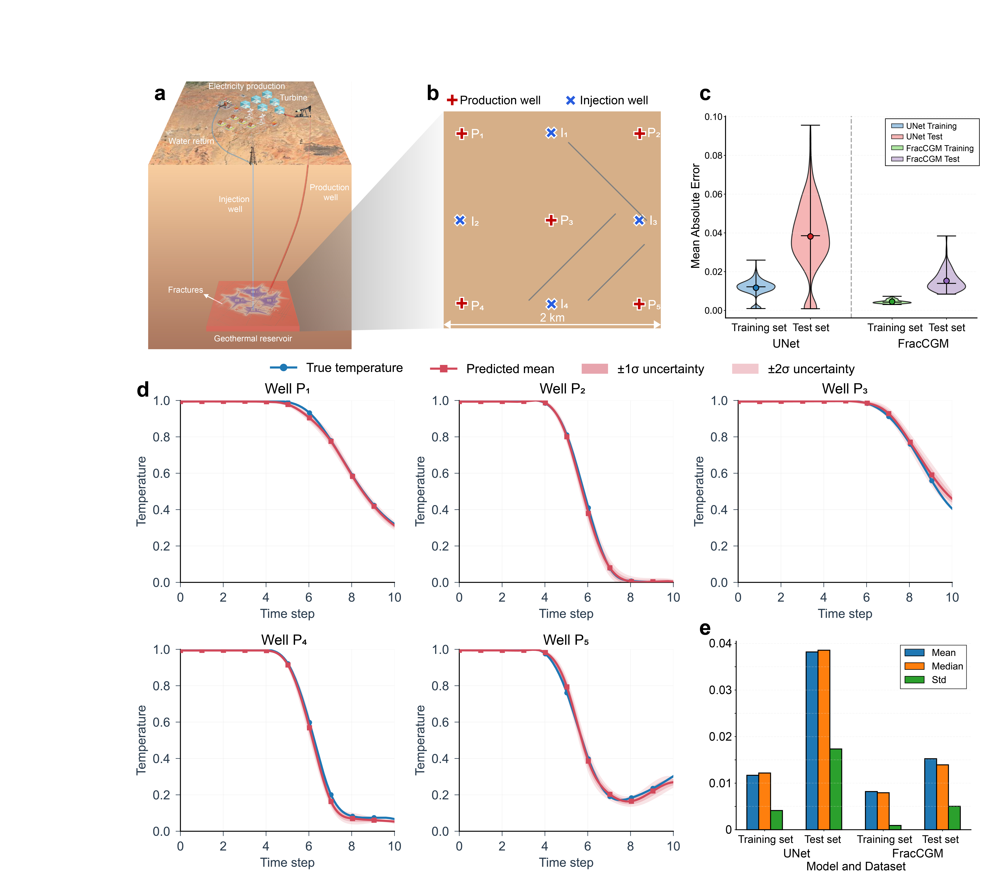
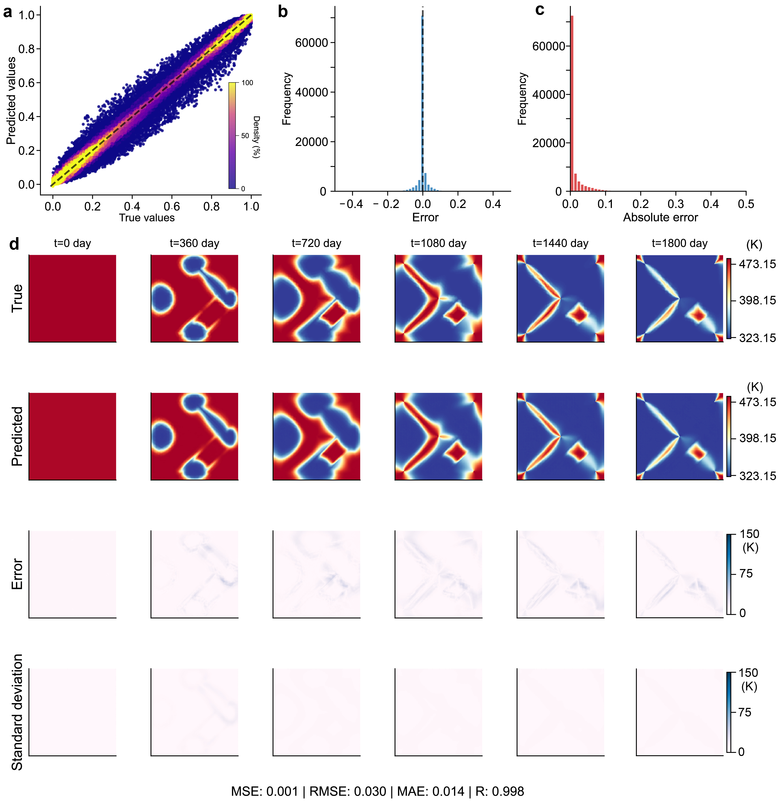
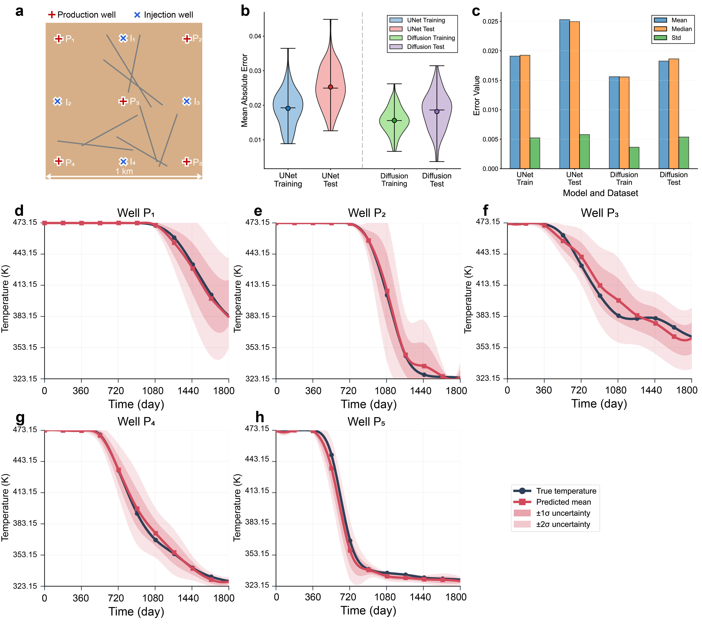
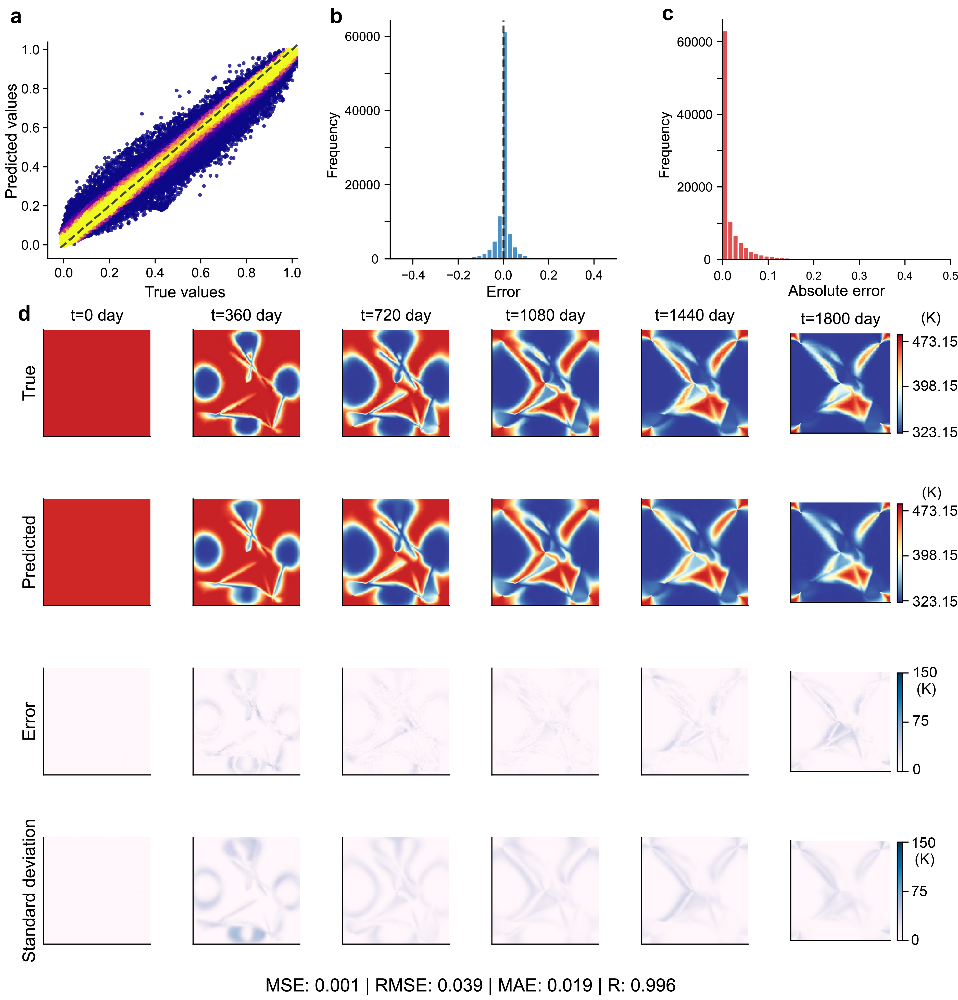
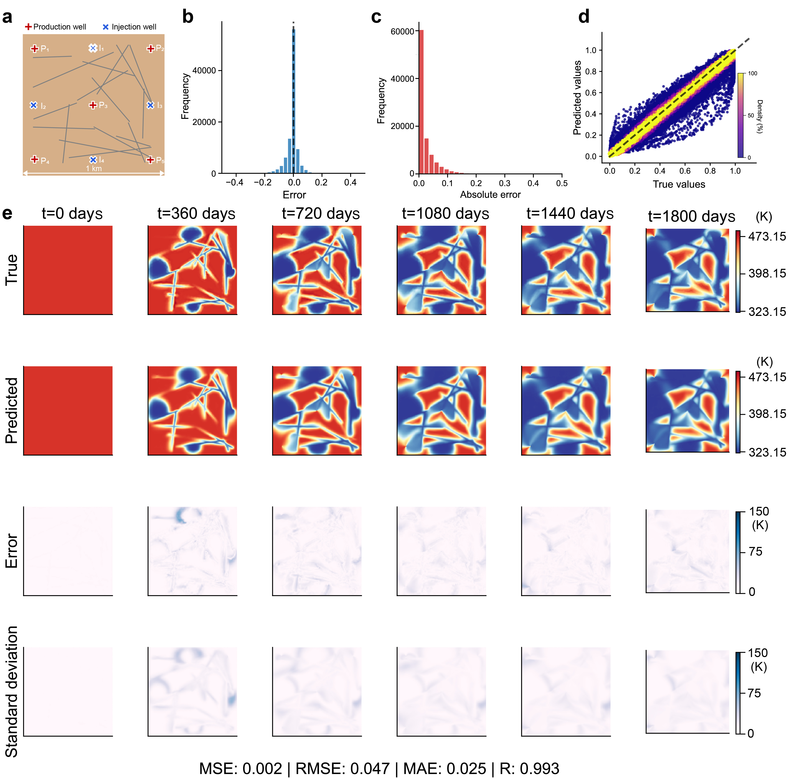
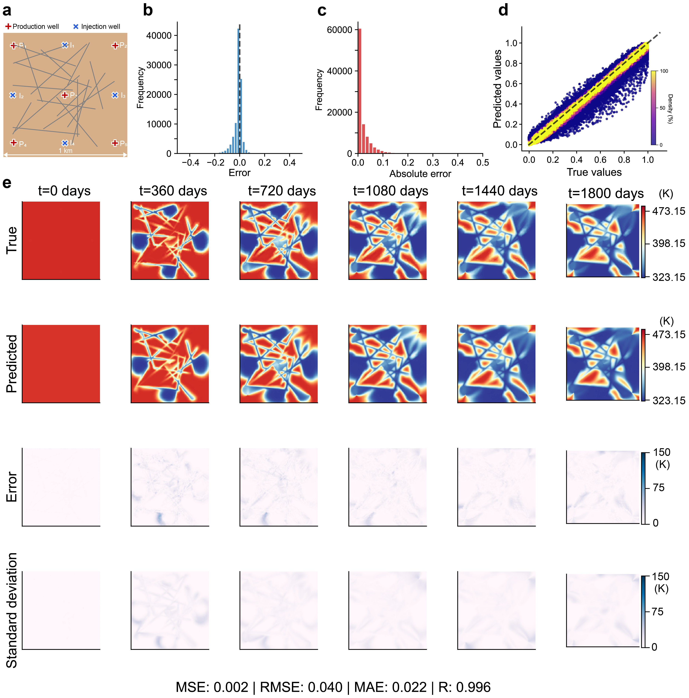

# FracCGM
Spatiotemporal Fluid Flow Prediction in Subsurface Fractured Media using Diffusion Models 
(conditional denoising diffusion implicit models with 2D UNet as basic framework)

[Guodong Chen*](https://scholar.google.com/citations?user=U2YFkAgAAAAJ&hl=zh-TW&oi=ao), 
[Nori Nakata](https://profiles.lbl.gov/88689-nori-nakata), 
Zhongzheng Wang, 
[Zhengfa Bi](https://profiles.lbl.gov/416831-zhengfa-bi), 
[Rie Nakata](https://profiles.lbl.gov/145475-rie-nakata)

---

Here, we present **FracCGM**, a deep-learning framework that leverages denoising diffusion conditional probabilistic models to generatively forecast the evolution of pressure and temperature fields in fractured geothermal reservoirs.

Trained on a diverse library of stochastically generated fracture networks and their corresponding physics-based flow simulations, our model demonstrates:

- High-fidelity probabilistic forecasting
- Generation of probabilistic ensembles
- Quantification of epistemic uncertainty
- Real-time probabilistic prediction capability

FracCGM provides a powerful and efficient paradigm for modeling complex subsurface flows and supports risk-aware geothermal reservoir management.

---

# Network Architecture


---

# Case 1  
## Fractured Geothermal System with Three Perpendicular Fractures



## Prediction Performance Visualization



---

# Case 2  
## Fractured Geothermal System with Eight Stochastic Fractures



## Prediction Performance Visualization



## Denoising Process Visualization (20 DDIM Steps)


## Fracture Network Inversion (Ensemble Smoother + Pretrained FracCGM)


---

# Case 3  

## Scenario 1



## Scenario 2



---

# Datasets

- `Binary_training.mat`
- `state_training.mat`

---

# Network Training

python main.py

# Autonomous Inverse Fracture Generation
python inference.py

If you find the paper or this repository helpful in your publications, please consider citing it.

```bibtex
@article{Chen2025Diffusion,
  title={Spatiotemporal Fluid Flow Prediction in Subsurface Fractured Media using Diffusion Models},
  author={Guodong, Chen; Nori, Nakata; Zhongzheng, Wang; Zhengfa, Bi; Rie, Nakata},
  year={2026},
}
```
